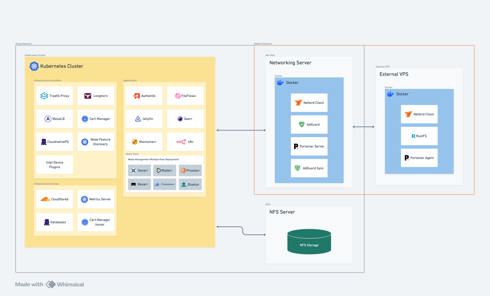

= Homelab
:toc:

This project is a GitOps configuration of a home server infrastructure. It contains services for smart home, media, automations, data storage and more. It is not only a template, but a fully working configuration which can be implemented by everyone with access to a personal server(s). This repo is deployed and used by the author, regularly updated and maintained. It uses best practices for the author which may not work for everyone.

If you want to use this project as template, go to <<deployment, deployment section>>.

.*What is a Homelab?*
[%collapsible]
====
****
A homelab is a personal home network with server (or servers) and services running on it. Typically it is destined to learn,  experiment and host personal services. Now it becames popular to also host AI agents, which are perfect example of homelabing, but this repo is focused on standard infrastracture. Full definition and community may be found on [r/homelab](https://www.reddit.com/r/homelab/).
****
====

== Overview

This repo contains two main modules - Docker and Kubernetes. Docker is used for core services on which the whole network depends or services hosted externally. Kubernetes is used for everything else.

In a diagram below there is a simplified overview of this repo architecture.

For more info, why it is may seem so overkill, go to <<philosophy-and-rules, Philosophy and Rules>>.

=== Core Services
Core (Docker) services are kept in link:docker[Docker folder].

[NOTE]
====
These services must be deployed manually (see <<deployment, deployment section>>). Author manages them using Portainer, but this is optional.
====

These services include mostly networking (DNS, DHCP, VPN etc.). For more see link:docker/README.md[Docker README].

=== External Services

As it is strictly advised backups or independent/vulnerable data are not stored on home servers. It means some services are hosted externally. For now author uses S3 storage hosted by himself (https://rustfs.com[RustFS]) on https://www.oracle.com/cloud/[OCI] VPS.

These VPS is connected to home network using Netbird, which allows it to be managed from self-hosted Portainer and expose services only to the homelab network. 

[NOTE]
====
VPS does not belong to Kubernetes Cluster and it's strongly disadvised to add VPS to a self-hosted Kubernetes cluster, especially one using Longhorn.
====

[WARNING]
====
Connecting VPS to home network via VPN may have security implications, so it should be thoroughly considered. Author strictly separates VPS from acccessing homelab servers via Netbird Access Control. VPS also has its own strict firewall. 
====

=== Kubernetes Cluster

Kubernetes cluster is the hearth of this homelab. it is default place where services and apps live. For simplicity and lightness it is managed declaratively (using this repo) via FluxCD. 

[NOTE]
====

This repo actual implementation uses K3S as Kubernetes distro, but other distros (K0S, K8S, MicroK8 etc.) may be used as well.

====

Thanks to GitOps apporach, services are deployed and updated automatically. (Almost) complete cluster configuration is stored in this repo (including ecnrypted secrets). K8S ensure stability and high uptime.

Cluster uses Traefik as ingress controller, Longhorn for storage (and data replication). For more specific infrastrure details see link:k8s/README.md[Kubernetes README].

[TIP]
====
**Alternatives**

There is excellent alternative to FluxCD - ArgoCD. It is more popular but in home networks it may be to heavy and complex. FluxCD was choosen for this repo due to its simplicity and lightness.

Also insteand of Kubernetes Docker Swarm ma be used, but it was not choosen for this repo, because author have exceeded its limits and wanted to have more control over services. 

====

[#philosophy-and-rules]
== Philosophy and Rules

This project is built to be as stable and reliable as possible, while also being easy to manage and update. It may seems overkill for most homelabs, but going for Kubernetes has it's advantages, which may not be obvious for everyone. These advantages are listed  below.

* Firstly, versioning. In K8S image updates are automatic. Author specifies version (e.g. `1.2.x`) and patches are applied automatically. No need to manually update images. In case of major updates, it is good practice to update the version manually and test it, but this philosohpgy is not taken for granted for each service separately.

* Secondly, stability and reliability. In K8S pods can be restarted or rebuilt automatically on failure. Some pods (like Cloudflare tunnels) can run on multiple nodes, which ensures high availability. 

* Thirdly, data integrity and safety. Longhorn ensures each service data are stored reduntantly on minimum two devices and backuped on the external S3 storage. All of these is automated and management is centralised.

* Fourthly, flexibility. In k8s applications are automatically distributed between nodes based on their resources and availability. Specific services can be pinned, but for most automatic distribution is more convienient and allows to scale (e.g. add more servers) without moving services manually.

* Fifthly, centralised management and monitoring. K8S (with FluxCD) allows for automatic and declaration-based deployment for the whole cluster. It means all services can be updated even without any access to the server - just by updating this repo.

* Sixthly, secrets management. K8S allows for the secrets to be encrypted and stored in this repository. It's secure and allows for simple updating secrets (also without direct access to the server).

* Seventhly, security in K8S is more advanced than in Docker. It allows for the granular control of the network access and resources. Traefik (Reverse Proxy) is seamlessly integrated with the whole cluster and allows for easy and secury exposing services. 

== Applications

This repository may be used as template for hosting various applications. Author uses it for hosting media (Jellyfin), automations (N8N), data storage (Postgres) and more. For more how to deploy apps details see link:k8s/README.md[Kubernetes README].

== Security, Durability and Reliability

Since self-hosting is often chosen for privacy and control, ensuring securit, durability and reliability is crucial and was one of the main goals for this project. Below is a detailed explaination of meet problems and applied solutions.

=== Backups

Since data losses tend to happen (for example due to SSDs failures) and in home environemnts data is usaually not replicated like in cloud, this repo stores all data on Longhorn volumes, which are replicated on (at least) two devices. What's more data are backed up on external S3 storage (hosted by the author on external VPS) and can be easily restored.

Author also hosts Home Assistant (which is not included in this repo) which is backuped on on google drive using https://github.com/sabeechen/hassio-google-drive-backup[hassio plugin].

=== Secrets Management

Secretes for Kubernetes cluster are stored and encrypted using SOPS and Age. It means that they are assymetrcially encrypted, pushed to this repo and decrypted only on the cluster. It is safe, simple and convienent.

=== Updates and Versions

All versions of apps and services are carefully choosen for stability and secuirty. Usually best way to define version is to specify major and minor only (e.g. `1.2.x` for Kubernetes, `1.2` for Docker), which allows for automatic patch updates, but prevents from breaking changes in case of major updates. For more details see <<philosophy-and-rules, Philosophy and Rules>>.

Some crucial services tho should be set to explicit versions (e.g. Traefik)
to prevent from any unexpected changes. There are also some that should be just set to latest, when they are still in early development and updates are common part of their lifecycle (e.g. N8N). 

=== Monitoring

Due to author is not a big fan of equipping homelab with various heavy monitoring tools, there is only basic and lightwight stack for monitoring. It includes Traefik dashboard, Portainer, Longhorn UI, Kubernets Metrics Server Home Asssitant Statistics and Netweave. 

Obviously using tools like Uptime Kuma is also an excellent choice, but this repo focuses on deploying lightweight and essential stack.

== Development Workflow

This repo is managed using standard Git workflow. Author decided to use only main branch (which is a standard for small GitOps environments without separate development and staging environments).

However a few tools were used to make work safer, easier and more convienent.

=== Prek (Pre-Commit)

Before every commit https://prek.j178.dev[Prek] is run, which checks for YAML syntax, validates Kubernetes secretes etc.

=== Quick Commands

Author also created specific script for encrypting secrets. They are store in files named `name.secret.yaml` and encrypted automatically using script below to `name-secret.enc.yaml`. It makes work easier and more convienient, while also ensuring that secrets are always encrypted before commiting.

[source,bash]
----
# Encrypt all secrets before committing
./encrypt-secrets.sh
----

== Tech stack summary

image:https://img.shields.io/badge/Kubernetes-326CE5?logo=kubernetes&logoColor=white[Kubernetes]
image:https://img.shields.io/badge/FluxCD-5468FF?logo=flux&logoColor=white[FluxCD]
image:https://img.shields.io/badge/Proxmox-E57000?logo=proxmox&logoColor=white[Proxmox]
image:https://img.shields.io/badge/Debian-A81D33?logo=debian&logoColor=white[Debian]
image:https://img.shields.io/badge/Docker-2496ED?logo=docker&logoColor=white[Docker]
image:https://img.shields.io/badge/PostgreSQL-4169E1?logo=postgresql&logoColor=white[PostgreSQL]
image:https://img.shields.io/badge/CloudNativePG-4456F7?logo=postgresql&logoColor=white[CloudNativePG]
image:https://img.shields.io/badge/SOPS-4B5563?logo=mozilla&logoColor=white[SOPS]
image:https://img.shields.io/badge/Age-111827?logo=letsencrypt&logoColor=white[Age]
image:https://img.shields.io/badge/Netbird-00B3FF?logo=wireguard&logoColor=white[Netbird]
image:https://img.shields.io/badge/Cloudflare-F38020?logo=cloudflare&logoColor=white[Cloudflare]
image:https://img.shields.io/badge/Traefik-24A1C1?logo=traefikmesh&logoColor=white[Traefik]
image:https://img.shields.io/badge/Pre--Commit-FAB040?logo=pre-commit&logoColor=black[Pre-Commit]
image:https://img.shields.io/badge/Helm-0F1689?logo=helm&logoColor=white[Helm]
image:https://img.shields.io/badge/Oracle%20Cloud-F80000?logo=oracle&logoColor=white[Oracle Cloud]
image:https://img.shields.io/badge/Raspberry%20Pi-C51A4A?logo=raspberrypi&logoColor=white[Raspberry Pi]
image:https://img.shields.io/badge/RustFS-000000?logo=rust&logoColor=white[RustFS]
image:https://img.shields.io/badge/N8N-EA4B71?logo=n8n&logoColor=white[N8N]
image:https://img.shields.io/badge/Authentik-FD4B2D?logo=auth0&logoColor=white[Authentik]
image:https://img.shields.io/badge/Longhorn-00AEEF?logo=kubernetes&logoColor=white[Longhorn]
image:https://img.shields.io/badge/MetalLB-2A5CAA?logo=kubernetes&logoColor=white[MetalLB]
image:https://img.shields.io/badge/AdGuard-68BC71?logo=adguard&logoColor=white[AdGuard]

== Hardware

This section focues not only on software infrastracture but rather on specific author deployment. It is added just to visualise the whole picture and give broader context. 

Homelabs differ a lot in terms of hardware (and price ranges). Author is limited by available hardware and budget, so the hardware infrastructre is rather modest, but deploying highly available K3s cluster is a proof of how important is software architrecture rather than only actual devices.

|===

| Name | Role | CPU | RAM | Storage | OS | Comment

| GMKtec NucBox G3 | K3s control pane, Home Assistant Server, Network services root, NFS server | Intel N100 | 16GB | 1TB NVMe | Proxmox VE | 

| Raspberry Pi 5 | K3s support node, Backup network | BCM2712 | 4GB | 128GB SSD | RPi OS Lite | 

| QNAP TS213P | Storage | AnnapurnaLabs Alpine AL212 1.7 GHz | 1GB | 2TB HDD | QNAP QTS | 

| Funbox 6 | ISP Router | - | - | - | - | Will be replaced soon |

|===

[#deployment]
== Deployment

Deployment guide will be available soon!
